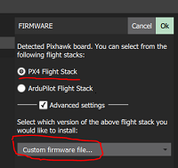
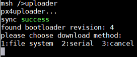

StarryPilot
============================
# About
A lightweight and powerful autopilot software, which focus on research and development of state-of-the-arts software for UAVs. One of the project’s primary goals is to provide an open and flexible platform making it easy to be applied into a broad range of domains.

# Feature
- RT-Thread RTOS, Fatfs file system
- Completely support with Pixhawk hardware
- ADRC control & PID control
- Support with Mavlink
- Support with Gazebo hardware-in-the-loop (HITL) simulation
- Msh shell system
- Logger system
- Parameter system

# Control

- [**优酷视频地址**](https://v.youku.com/v_show/id_XMzY2Njg4ODk4NA==.html?spm=a2hzp.8244740.0.0)

# Simulator
- [*Matlab simulator*](https://github.com/JcZou/matlab_quadsim) (Software-in-the-loop)
- [*Gazebo simulator*](https://github.com/JcZou/gazebo_quadsim) (Hardware-in-the-loop)

# Tools
- Calibration software (magnetometer and accelerometer calibration)
- Logger checker

# Usage
The project is developed on Pixhawk (autopilot hardware). To download firmware into Pixhawk, please follow these steps:
- First compile the starry_fmu and generate bin file.
- Use QGroundControl (QGC) to download the bin file into fmu. To download custom firmware, choose the following choice.

- Now the firmware of starry_fmu should be correctly downloaded (If failed, please try again, or use the newer version of QGC). Connect Radio-telemetry to the **TELEM 2** port of Pixhawk, then you should see the Msh shell system output via serial terminal (default baudrate is **57600**).

- If you didn't format the SD card before, please type `mkfs` command to format the SD card.
- Then you should download the starry_io firmware. To do so, first compile starry_io project to get the bin file and name it as **starryio.bin**. Copy the starryio.bin to the **root directory** of SD card, then open Msh shell system and type `uploader`, which is shown below.

- Choose **file system** option to start download. Notice that if it's the first time that you download starry_io, after you type uploader, you should push reset button of io (in the side of Pixhawk) to let io enter the bootloader.
- Congratulation, now the download is finished!

# Author
*Jiachi Zou*
---------------------------
*email*: zoujiachi666@163.com 

*LinkedIn*: www.linkedin.com/in/jiachizou-0710

*QQ群*: 459133925
